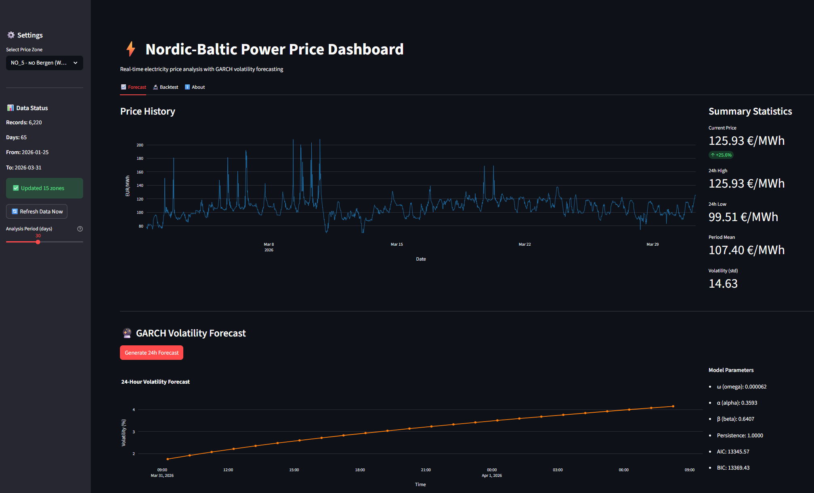
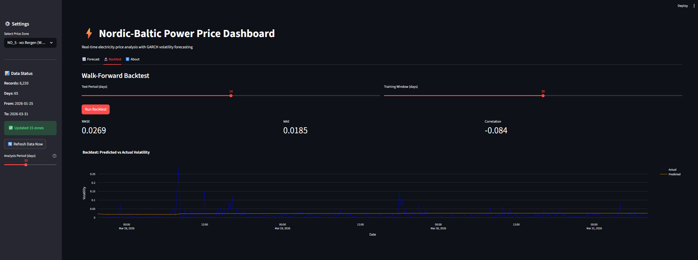

# Nordic-Baltic Power Price Dashboard

**Real-time electricity price analysis with GARCH volatility forecasting for Nordic-Baltic markets**

---

## Overview

End-to-end system for analyzing Nordic-Baltic electricity spot prices:

- **15 Price Zones**: Norway (5), Sweden (4), Denmark (2), Finland (1), Estonia (1), Latvia (1), Lithuania (1)
- **GARCH Forecasting**: 24-hour volatility predictions
- **Auto-updating**: Dashboard fetches latest prices on startup
- **Backtesting**: Walk-forward performance evaluation

**The forecast preview:**


**The backtest preview:**

---

## Quick Start

### 1. Clone and Setup

```bash
git clone https://github.com/AmalieBerg/nordic-power-dashboard.git
cd nordic-power-dashboard

# Create virtual environment
python -m venv venv
source venv/bin/activate  # Windows: venv\Scripts\activate

# Install dependencies
pip install -r requirements.txt
```

### 2. Configure API Token

Get your free ENTSO-E API token from [transparency.entsoe.eu](https://transparency.entsoe.eu/)  Account Settings  Web API Security Token

```bash
# Create .env file
echo "ENTSOE_API_TOKEN=your-token-here" > .env
```

### 3. Fetch Historical Data

```bash
# Fetch 60 days for all Nordic zones (~15-20 minutes)
python fetch_all_nordic.py

# Or fetch just Norwegian zones (~5 minutes)
python fetch_60_days.py
```

### 4. Run Dashboard

```bash
streamlit run app.py
# Or: python -m streamlit run app.py
```

Open http://localhost:8501 in your browser.

---

## Nordic-Baltic Price Zones

| Country | Zones | Coverage |
|---------|-------|----------|
|  Norway | NO_1, NO_2, NO_3, NO_4, NO_5 | Oslo, Kristiansand, Trondheim, Tromsø, Bergen |
|  Sweden | SE_1, SE_2, SE_3, SE_4 | Luleå, Sundsvall, Stockholm, Malmö |
|  Denmark | DK_1, DK_2 | West (Jutland), East (Zealand) |
|  Finland | FI | Nationwide |
|  Estonia | EE | Nationwide |
|  Latvia | LV | Nationwide |
|  Lithuania | LT | Nationwide |

---

## Features

### Dashboard (app.py)
- **Auto-update**: Fetches latest 7 days on startup (cached 1 hour)
- **Zone selector**: All 15 Nordic zones
- **Price charts**: Interactive Plotly visualizations
- **GARCH forecast**: 24-hour volatility predictions
- **Backtesting**: Configurable test/train periods
- **Manual refresh**: Button to force data update

### Data Pipeline (src/data/)
- **ENTSO-E client**: Retry logic, rate limiting, error handling
- **SQLite database**: Efficient storage with UPSERT
- **Smart fetcher**: Backfill, update, gap detection

### GARCH Models (src/models/)
- **GARCH**: Volatility clustering model
- **Backtesting**: 6 performance metrics (RMSE, MAE, Direction Accuracy, etc.)
- **Production pipeline**: Daily forecast generation

---

## Project Structure

```
nordic-power-dashboard/
├── app.py                    # Streamlit dashboard (main entry)
├── fetch_all_nordic.py       # Fetch all 12 Nordic zones
├── fetch_60_days.py          # Fetch single zone (NO_2)
├── requirements.txt          # Python dependencies
├── .env                      # API token (create this)
├── .env.template             # Template for .env
├── data/
│   └── prices.db             # SQLite database (auto-created)
└── src/
    ├── data/
    │   ├── database.py       # SQLite operations
    │   ├── entsoe_client.py  # ENTSO-E API wrapper
    │   └── fetcher.py        # Data orchestration
    ├── models/
    │   ├── garch_forecaster.py  # GARCH implementation
    │   ├── backtest.py          # Performance evaluation
    │   └── pipeline.py          # Production pipeline
    └── utils/
        └── config.py         # Configuration management
```

---

## Technical Details


### GJR-GARCH(1,1) Model

The conditional variance follows:
$$\sigma_t^2 = \omega + \alpha \epsilon_{t-1}^2 + \gamma \epsilon_{t-1}^2 \mathbb{1}(\epsilon_{t-1} < 0) + \beta \sigma_{t-1}^2$$

Where:
- ω (omega): Long-run variance weight
- α (alpha): Impact of recent shocks
- γ (gamma): Asymmetric (leverage) effect — extra impact when the shock is negative
- β (beta): Persistence of volatility
- 𝟙(·): Indicator function, equals 1 when the previous shock was negative, 0 otherwise

Persistence is measured as α + β + γ/2.

### Performance Metrics

| Metric | Description |
|--------|-------------|
| RMSE | Root Mean Squared Error |
| MAE | Mean Absolute Error |
| Direction Accuracy | % correct volatility trend predictions |
| Mincer-Zarnowitz R² | Forecast efficiency |

Typical results on NO_2:
- Direction Accuracy: ~71%
- MZ R²: ~0.79

---

## API Usage

```python
from src.models import ForecastPipeline

# Generate daily forecast
pipeline = ForecastPipeline(zone='NO_2')
forecast, diagnostics = pipeline.run_daily_forecast()

# Run backtest
results, metrics = pipeline.backtest_historical(test_days=30)

# Get JSON for API
forecast_json = pipeline.get_latest_forecast()
```

---

## Requirements

- Python 3.10+
- ENTSO-E API token (free)
- ~500MB disk space for 2 years of data

### Key Dependencies

```
pandas>=2.0.0
streamlit>=1.29.0
arch>=5.3.0
entsoe-py>=0.6.0
plotly>=5.18.0
```

---

## Troubleshooting

### "No data in database"
```bash
python fetch_all_nordic.py
```

### "ENTSOE_API_TOKEN not found"
```bash
echo "ENTSOE_API_TOKEN=your-token" > .env
```

### Import errors
```bash
# Run from project root
cd nordic-power-dashboard
python -m streamlit run app.py
```

### Streamlit path error (Windows)
```bash
# Use module syntax instead
python -m streamlit run app.py
```


---

## License

MIT License - See [LICENSE](LICENSE) for details.
